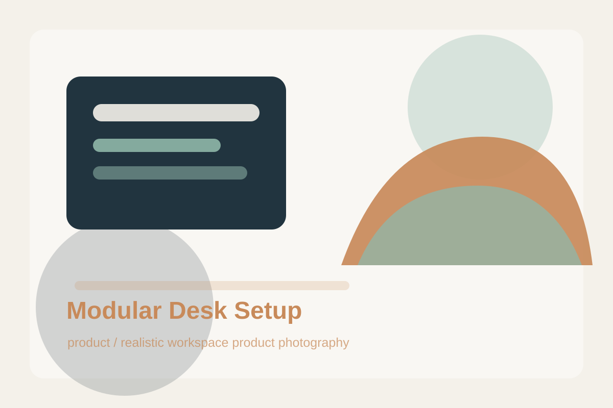
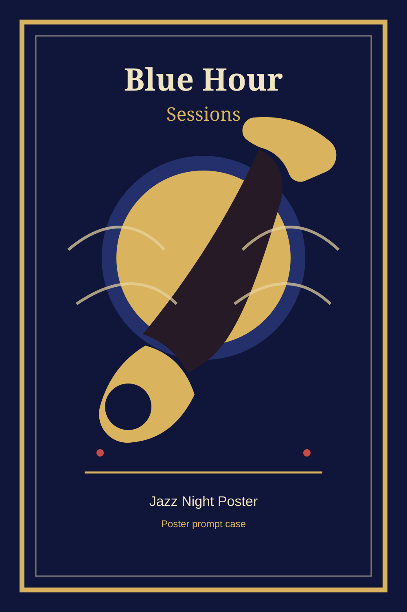
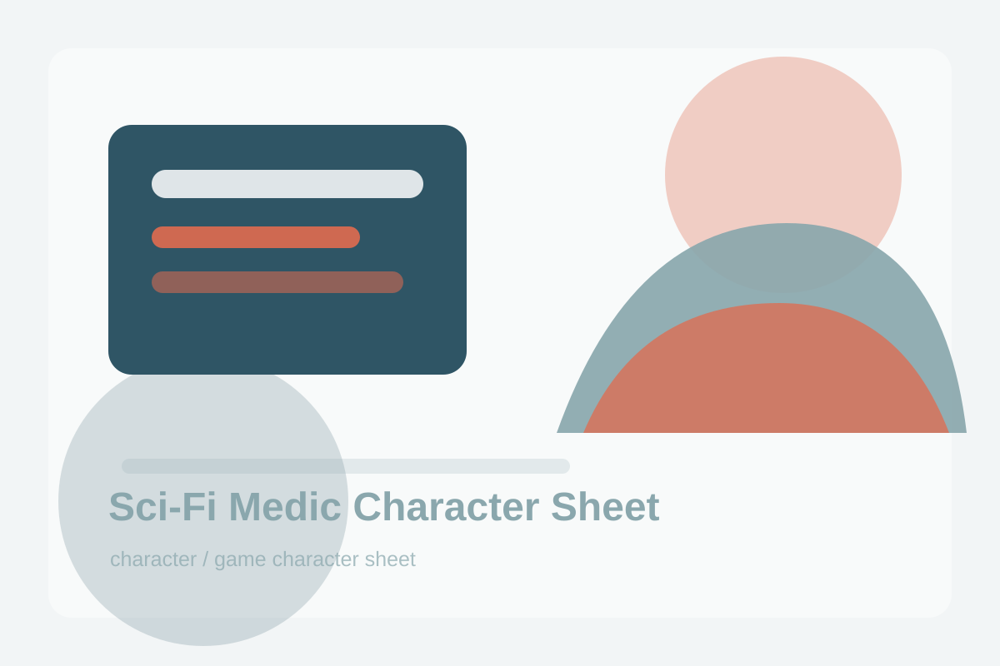
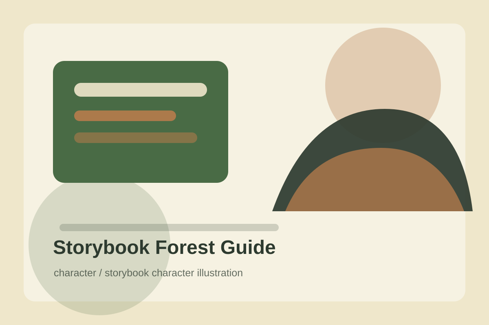
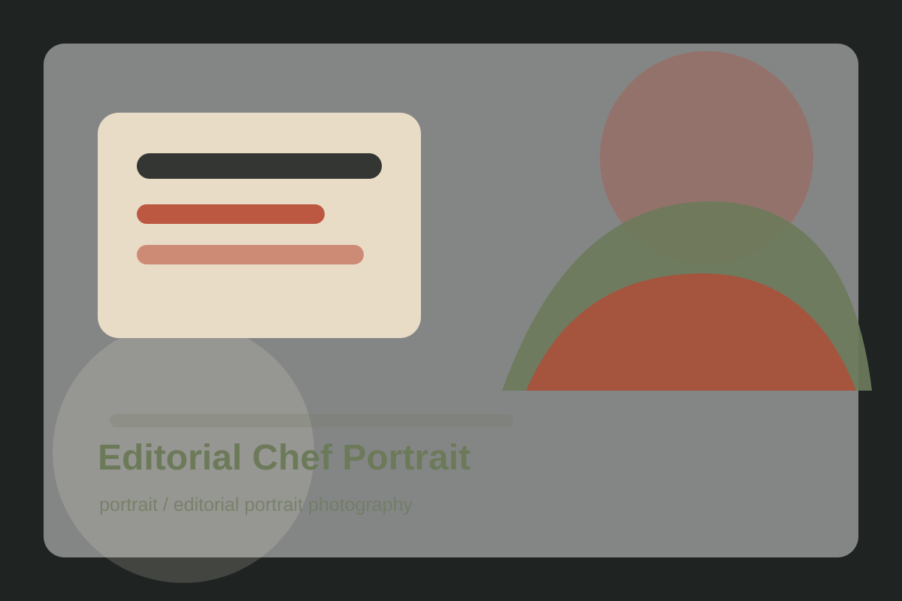
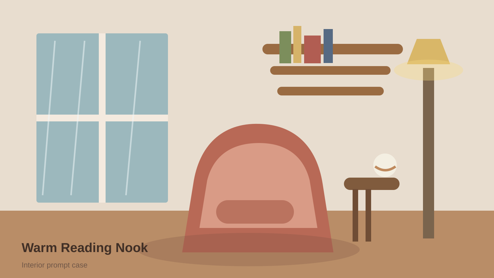
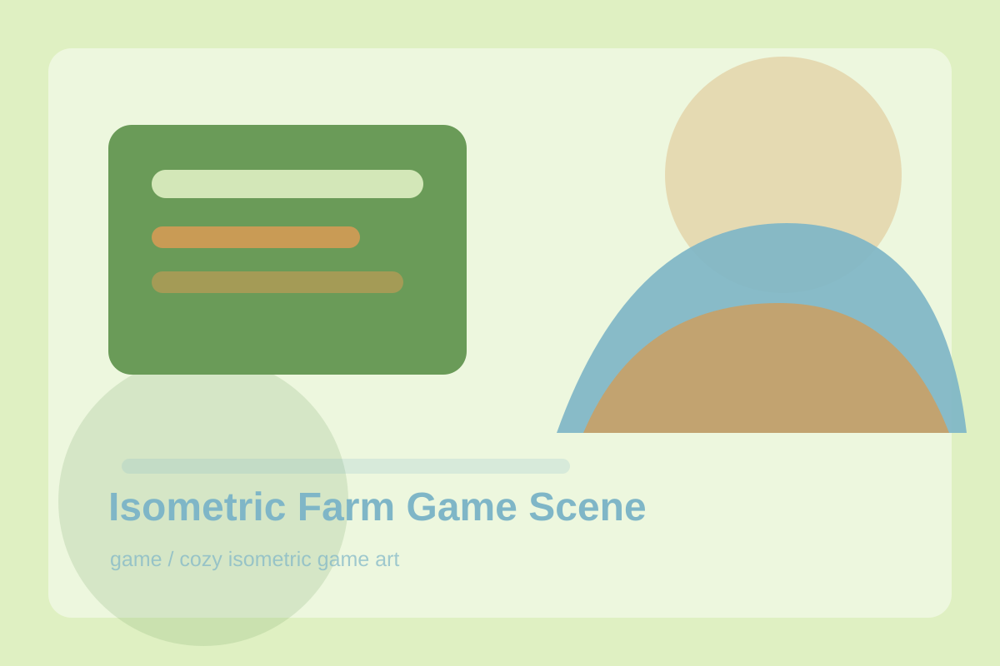
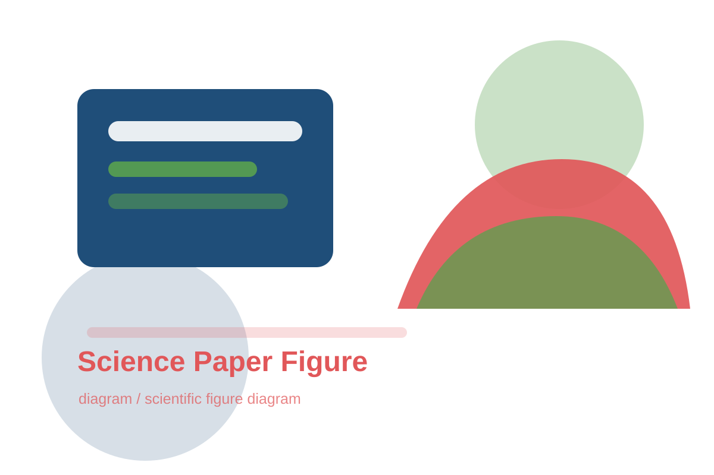
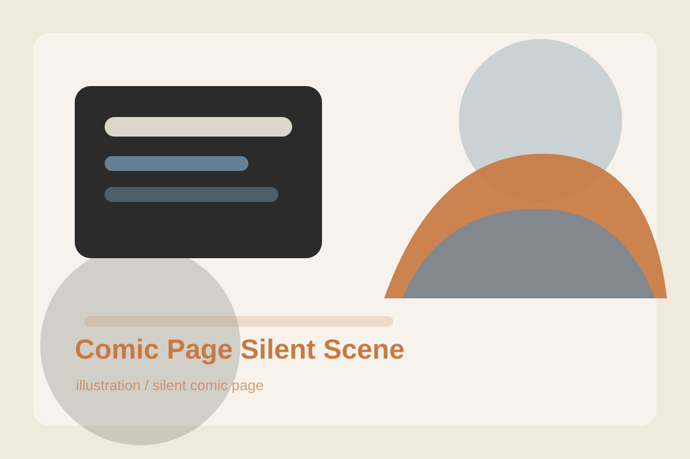

# GPT Image 2 Prompt Gallery

按分类浏览 GPT Image 2 提示词与图片案例。每张卡片都直接展示提示词摘要；完整提示词、负向约束、参数和复盘在案例目录中。

## Category Index

| Category | Count | Jump |
| --- | ---: | --- |
| product | 8 | [View](#product) |
| poster | 7 | [View](#poster) |
| character | 4 | [View](#character) |
| portrait | 2 | [View](#portrait) |
| ui | 4 | [View](#ui) |
| interior | 1 | [View](#interior) |
| food | 1 | [View](#food) |
| fashion | 1 | [View](#fashion) |
| game | 1 | [View](#game) |
| diagram | 2 | [View](#diagram) |
| illustration | 3 | [View](#illustration) |

## product

### Botanical Packaging Flatlay


- Path: [cases/product/botanical-packaging-flatlay](cases/product/botanical-packaging-flatlay/prompt.md)
- Source: Original
- License: CC BY 4.0
- Tags: `product` `packaging` `sustainable` `flat-lay`

**Prompt Preview**

```text
Create a clean flat-lay product photograph of sustainable botanical packaging for a fictional herbal soap brand. Arrange two kraft paper boxes, one unwrapped green soap bar, eucalyptus leaves, cotton string, recycled paper tags, and a small ceramic dish on a warm off-white surface. Use top-down composition, soft diffused daylight, natural shadows, and a rest...
```

### Ceramic Tea Set Hero


- Path: [cases/product/ceramic-tea-set-hero](cases/product/ceramic-tea-set-hero/prompt.md)
- Source: Original
- License: CC BY 4.0
- Tags: `product` `ceramic` `still-life` `editorial`

**Prompt Preview**

```text
Create an editorial still-life photograph of a handmade ceramic tea set on a low stone table. Include a small teapot, two imperfect cups, loose tea leaves, a linen napkin, and a thin trail of steam. The ceramics have a speckled celadon glaze with tiny irregularities and hand-thrown edges. Use a muted beige background, soft side light, shallow depth of field,...
```

### Holographic Perfume Campaign


- Path: [cases/product/holographic-perfume-campaign](cases/product/holographic-perfume-campaign/prompt.md)
- Source: Original
- License: CC BY 4.0
- Tags: `product` `fragrance` `luxury` `campaign`

**Prompt Preview**

```text
Create a square luxury fragrance campaign image featuring a transparent glass perfume bottle with a fictional label reading 'AURORA VEIL'. The bottle stands on a glossy black acrylic surface with holographic light caustics, soft mist, and delicate refractions through the glass. Use high-contrast studio lighting, cool blue and violet rim lights, warm gold hig...
```

### Luxury Chronograph Watch Ad


- Path: [cases/web-curated/luxury-chronograph-watch-ad](cases/web-curated/luxury-chronograph-watch-ad/prompt.md)
- Source: EvoLinkAI/awesome-gpt-image-2-API-and-Prompts
- License: CC0-1.0
- Tags: `product` `watch` `luxury` `advertising`

**Prompt Preview**

```text
A dramatic luxury product advertising image for a motorsport-inspired chronograph wristwatch in a dark studio. Center-left foreground, show a single stainless steel chronograph watch standing upright at a slight three-quarter angle, with a black dial, two red-accent subdials, slim silver hour markers, a tachymeter bezel, and visible crown and pushers on the...
```

### Luxury Wooden Door Detail


- Path: [cases/web-curated/imgedify-luxury-wooden-door](cases/web-curated/imgedify-luxury-wooden-door/prompt.md)
- Source: ImgEdify/Awesome-GPT4o-Image-Prompts
- License: MIT
- Tags: `product` `material` `macro` `photography`

**Prompt Preview**

```text
A close-up photograph of a luxurious wooden door with detailed paneling and rich grain texture. The door features a custom-shaped doorknob in the form of the [LOGO_NAME] logo, made of polished material (metal, brass, ceramic, etc.) to look realistic and tangible. The handle is mounted on an antique bronze base, with soft, ambient lighting emphasizing the ref...
```

### Miniature Diorama Skincare Advertisement


- Path: [cases/web-curated/skincare-miniature-diorama](cases/web-curated/skincare-miniature-diorama/prompt.md)
- Source: EvoLinkAI/awesome-gpt-image-2-API-and-Prompts
- License: CC0-1.0
- Tags: `product` `ecommerce` `miniature` `commercial`

**Prompt Preview**

```text
A hyper-realistic miniature diorama product advertisement featuring an oversized luxury skincare pump bottle labeled "LUXEVEIL Skin Science - Radiance Nourishing Body Lotion" in cream/beige with a polished gold pump top, placed on a circular platform. Tiny figurine construction workers dressed in yellow coveralls and white hard hats swarm around the bottle c...
```

### Minimal Sneaker Ad


- Path: [cases/product/minimal-sneaker-ad](cases/product/minimal-sneaker-ad/prompt.md)
- Source: Original
- License: See metadata
- Tags: `product` `studio-light` `minimal` `ecommerce`

**Prompt Preview**

```text
Create a premium studio product photograph of a futuristic white running sneaker floating slightly above a matte stone pedestal. The sneaker has subtle silver mesh panels, translucent air cushioning, and precise stitched details. Use a clean off-white background with a soft blue-gray shadow gradient. The composition is centered, with generous negative space...
```

### Modular Desk Setup



- Path: [cases/product/modular-desk-setup](cases/product/modular-desk-setup/prompt.md)
- Source: Original
- License: CC BY 4.0
- Tags: `product` `workspace` `minimal` `tech`

**Prompt Preview**

```text
Create a premium product photograph of a modular home-office desk setup with a slim monitor, mechanical keyboard, wireless charger, ceramic pen cup, and stackable oak organizer trays. The desk is matte walnut with clean cable management and a soft linen wall behind it. Use eye-level composition, gentle morning window light from the left, realistic shadows, a...
```


## poster

### Architectural Section Poster


- Path: [cases/poster/architectural-section-poster](cases/poster/architectural-section-poster/prompt.md)
- Source: Original
- License: CC BY 4.0
- Tags: `poster` `architecture` `section` `editorial`

**Prompt Preview**

```text
Create a vertical architectural poster showing a cutaway section of a compact urban library. The building is sliced open like a precise editorial illustration, revealing reading rooms, staircases, book stacks, a rooftop garden, a cafe corner, and tiny visitors moving through the space. Use clean ink lines, soft watercolor fills, warm cream paper texture, and...
```

### Boston Spring 2026 City Poster


- Path: [cases/web-curated/boston-spring-city-poster](cases/web-curated/boston-spring-city-poster/prompt.md)
- Source: EvoLinkAI/awesome-gpt-image-2-API-and-Prompts
- License: CC0-1.0
- Tags: `poster` `travel` `city` `illustration`

**Prompt Preview**

```text
A striking Spring 2026 city poster for Boston with an elegant celebratory mood and a bold contemporary design. On a clean off-white textured background with large areas of negative space, a miniature single sculler rows across the lower right corner of the image on a narrow ribbon of reflective water. The wake from the oar sweeps upward in a dynamic calligra...
```

### Farmers Market Event Poster


- Path: [cases/poster/farmers-market-event-poster](cases/poster/farmers-market-event-poster/prompt.md)
- Source: Original
- License: CC BY 4.0
- Tags: `poster` `event` `risograph` `food`

**Prompt Preview**

```text
Create a cheerful vertical risograph-style event poster for a fictional weekend farmers market. The central illustration shows a basket overflowing with tomatoes, peaches, leafy greens, flowers, and a small loaf of bread. Use bold flat shapes, slight print misregistration, grainy ink texture, and a palette of tomato red, leafy green, golden yellow, and cream...
```

### Iced Coffee Product Infographic


- Path: [cases/web-curated/iced-coffee-product-infographic](cases/web-curated/iced-coffee-product-infographic/prompt.md)
- Source: EvoLinkAI/awesome-gpt-image-2-API-and-Prompts
- License: CC0-1.0
- Tags: `infographic` `beverage` `product` `commercial`

**Prompt Preview**

```text
A high-end cafe-style product photograph of a transparent glass filled with iced coffee, centered against a soft beige and cream seamless studio background. The drink shows a rich dark coffee base blending with creamy milk swirls, creating a smooth gradient effect. Several clear ice cubes are visible with realistic transparency and light refraction. The glas...
```

### Illustrated City Food Map


- Path: [cases/web-curated/illustrated-city-food-map](cases/web-curated/illustrated-city-food-map/prompt.md)
- Source: YouMind-OpenLab/awesome-gpt-image-2
- License: CC BY 4.0
- Tags: `map` `food` `infographic` `watercolor`

**Prompt Preview**

```text
{ "type": "illustrated map infographic", "style": "{argument name=\"art style\" default=\"watercolor and ink hand-drawn illustration on vintage parchment\"}", "title_section": { "text": "{argument name=\"city name\" default=\"成都\"} {argument name=\"map title\" default=\"吃货暴走地图\"}", "mascot": "cartoon red chili pepper wearing sunglasses and giving a thumbs up...
```

### Jazz Night Poster



- Path: [cases/poster/jazz-night-poster](cases/poster/jazz-night-poster/prompt.md)
- Source: Original
- License: See metadata
- Tags: `poster` `music` `branding` `vintage`

**Prompt Preview**

```text
Create a vertical vintage-inspired jazz concert poster for an imaginary event called "Blue Hour Sessions". The main visual is a golden saxophone silhouette crossing a deep indigo moon, surrounded by subtle paper grain, smoky stage light, and abstract rhythm lines. Use strong hierarchy with space for the event title at the top, date and venue at the bottom, a...
```

### Museum Exhibition Key Visual


- Path: [cases/poster/museum-exhibition-key-visual](cases/poster/museum-exhibition-key-visual/prompt.md)
- Source: Original
- License: CC BY 4.0
- Tags: `poster` `museum` `campaign` `minimal`

**Prompt Preview**

```text
Create a refined museum exhibition key visual for a fictional show titled 'Fragments of Tomorrow'. The image features a single abstract ceramic shard floating in the center, lit like a precious artifact, with subtle cracks, matte glaze, and a faint red reflection beneath it. Use a quiet stone-gray background, large negative space, elegant editorial compositi...
```


## character

### Anime Martial Arts Battle Illustration


- Path: [cases/web-curated/anime-martial-arts-battle](cases/web-curated/anime-martial-arts-battle/prompt.md)
- Source: YouMind-OpenLab/awesome-gpt-image-2
- License: CC BY 4.0
- Tags: `character` `anime` `action` `illustration`

**Prompt Preview**

```text
An anime-style illustration of a {argument name="action type" default="high-impact martial arts battle"} between two young female fighters in a {argument name="setting" default="traditional wooden martial arts dojo"}. In the foreground, a girl with black hair in a high bun wears a {argument name="character 1 color theme" default="red and white"} Chinese-styl...
```

### Cyberpunk Delivery Girl


- Path: [cases/character/cyberpunk-delivery-girl](cases/character/cyberpunk-delivery-girl/prompt.md)
- Source: Original
- License: See metadata
- Tags: `character` `neon` `cinematic` `game`

**Prompt Preview**

```text
Create a cinematic character concept image of a young futuristic delivery rider standing under neon rain in a dense cyberpunk alley. She wears a lightweight reflective courier jacket, a compact backpack with glowing route indicators, fingerless gloves, and practical streetwear boots. Her expression is calm and focused, with rain droplets on her hair and jack...
```

### Sci-Fi Medic Character Sheet



- Path: [cases/character/sci-fi-medic-character-sheet](cases/character/sci-fi-medic-character-sheet/prompt.md)
- Source: Original
- License: CC BY 4.0
- Tags: `character` `sci-fi` `game` `sheet`

**Prompt Preview**

```text
Create a professional sci-fi game character sheet for a battlefield medic from an original universe. Show one full-body front view, one three-quarter pose, and three close-up callouts for helmet visor, medical wrist scanner, and compact drone pack. The medic wears white and teal modular armor with orange emergency markings, fabric joints, utility pouches, an...
```

### Storybook Forest Guide



- Path: [cases/character/storybook-forest-guide](cases/character/storybook-forest-guide/prompt.md)
- Source: Original
- License: CC BY 4.0
- Tags: `character` `storybook` `fantasy` `illustration`

**Prompt Preview**

```text
Create a warm storybook character illustration of a young forest guide standing at the edge of an ancient mossy trail. The character wears a practical olive cloak, leather satchel, carved wooden compass, and patched boots. Their expression is curious and kind, with wind-tousled hair and a small lantern glowing at their side. The background includes fern silh...
```


## portrait

### Editorial Chef Portrait



- Path: [cases/portrait/editorial-chef-portrait](cases/portrait/editorial-chef-portrait/prompt.md)
- Source: Original
- License: CC BY 4.0
- Tags: `portrait` `editorial` `food` `photography`

**Prompt Preview**

```text
Create an editorial portrait photograph of an independent chef standing in a small open kitchen after service. The chef wears a clean cream apron over a dark shirt, with relaxed posture, natural expression, and lightly flour-dusted hands. In the background, show soft bokeh from copper pans, herbs, and a warm prep light, but keep the face sharply focused. Use...
```

### Typographic Portrait


- Path: [cases/web-curated/imgedify-typographic-portrait](cases/web-curated/imgedify-typographic-portrait/prompt.md)
- Source: ImgEdify/Awesome-GPT4o-Image-Prompts
- License: MIT
- Tags: `portrait` `typography` `poster` `experimental`

**Prompt Preview**

```text
Recreate the attached image as Typography Portrait. Subject is happiness.
```


## ui

### Finance Dashboard Dark Mode


- Path: [cases/ui/finance-dashboard-dark-mode](cases/ui/finance-dashboard-dark-mode/prompt.md)
- Source: Original
- License: CC BY 4.0
- Tags: `ui` `dashboard` `finance` `saas`

**Prompt Preview**

```text
Create a polished dark-mode SaaS finance dashboard UI for a small business owner. Show a left navigation rail, top filter bar, revenue KPI cards, cash-flow line chart, expense category bars, invoice status table, and a compact alerts panel. Use dense but readable spacing, crisp typography, subtle borders, muted charcoal surfaces, green positive indicators, a...
```

### Minimal 3D Icon Render


- Path: [cases/web-curated/imgedify-minimal-3d-icons](cases/web-curated/imgedify-minimal-3d-icons/prompt.md)
- Source: ImgEdify/Awesome-GPT4o-Image-Prompts
- License: MIT
- Tags: `ui` `icon` `3d` `minimal`

**Prompt Preview**

```text
minimalist 3D render, [Subject], soft matte finish, black and antique gold details, pristine white backdrop, isometric angle, ambient glow, feathered shadows, simple and elegant
```

### One-Prompt UI Design Generation


- Path: [cases/web-curated/one-prompt-ui-design-generation](cases/web-curated/one-prompt-ui-design-generation/prompt.md)
- Source: EvoLinkAI/awesome-gpt-image-2-API-and-Prompts
- License: CC0-1.0
- Tags: `ui` `design-system` `mobile` `web`

**Prompt Preview**

```text
用这种风格帮我生成一套UI设计系统，包含网页、移动端、卡片、控件、按钮 以及其它
```

### Travel Booking Mobile Flow


- Path: [cases/ui/travel-booking-mobile-flow](cases/ui/travel-booking-mobile-flow/prompt.md)
- Source: Original
- License: CC BY 4.0
- Tags: `ui` `mobile` `travel` `booking`

**Prompt Preview**

```text
Create a set of four mobile app screens for a modern train travel booking app. Include search, route results, seat selection, and ticket confirmation screens arranged side by side on a neutral background. Use a calm teal and warm orange palette, clear icons, compact cards, route timelines, station abbreviations, seat map grid, and a prominent confirmation QR...
```


## interior

### Warm Reading Nook



- Path: [cases/interior/warm-reading-nook](cases/interior/warm-reading-nook/prompt.md)
- Source: Original
- License: See metadata
- Tags: `interior` `warm` `lifestyle` `editorial`

**Prompt Preview**

```text
Create a cozy interior design photograph of a small reading nook beside a tall window on a rainy afternoon. Include a low linen armchair, a walnut side table, a ceramic mug, stacked books, a woven rug, and a slim brass floor lamp. The room has warm plaster walls, natural oak shelves, a few green plants, and soft reflections on the window glass. Use a wide bu...
```


## food

### Editorial Dessert Photography


- Path: [cases/food/editorial-dessert-photography](cases/food/editorial-dessert-photography/prompt.md)
- Source: Original
- License: CC BY 4.0
- Tags: `food` `dessert` `photography` `editorial`

**Prompt Preview**

```text
Create a fine-dining dessert photograph of a small plated citrus tart with torched meringue peaks, candied orange peel, a glossy sauce dot pattern, and a single edible flower. The plate is matte ivory ceramic on a dark walnut table. Use a low three-quarter camera angle, shallow depth of field, warm side light, realistic crumbs, and precise plating details. T...
```


## fashion

### Streetwear Lookbook Spread


- Path: [cases/fashion/streetwear-lookbook-spread](cases/fashion/streetwear-lookbook-spread/prompt.md)
- Source: Original
- License: CC BY 4.0
- Tags: `fashion` `lookbook` `streetwear` `editorial`

**Prompt Preview**

```text
Create a two-page fashion lookbook spread for an original streetwear capsule collection. Show three models in layered neutral outfits with oversized jackets, cropped utility vests, wide trousers, and textured sneakers. Use an urban concrete courtyard, overcast daylight, editorial poses, and a layout with one large hero photo, two smaller detail crops, fabric...
```


## game

### Isometric Farm Game Scene



- Path: [cases/game/isometric-farm-game-scene](cases/game/isometric-farm-game-scene/prompt.md)
- Source: Original
- License: CC BY 4.0
- Tags: `game` `isometric` `cozy` `environment`

**Prompt Preview**

```text
Create a cozy isometric game environment tile showing a tiny spring farm. Include a small cottage, vegetable plots, fruit trees, a pond, stone paths, tool shed, chicken coop, and a few cute non-branded interface markers. Use soft stylized 3D shapes, rounded forms, clear readable silhouettes, warm sunlight, and a cheerful pastel palette. The scene should look...
```


## diagram

### Retro-Futuristic Blueprint Schematic


- Path: [cases/web-curated/imgedify-blueprint-schematic](cases/web-curated/imgedify-blueprint-schematic/prompt.md)
- Source: ImgEdify/Awesome-GPT4o-Image-Prompts
- License: MIT
- Tags: `diagram` `blueprint` `industrial` `vehicle`

**Prompt Preview**

```text
A blueprint schematic of a retro-futuristic motorcycle, drawn in the style of early 20th-century industrial patents. Rendered in crisp blue ink with white technical lines, featuring exploded views, angular labels, and stamped diagram codes.
```

### Science Paper Figure



- Path: [cases/diagram/science-paper-figure](cases/diagram/science-paper-figure/prompt.md)
- Source: Original
- License: CC BY 4.0
- Tags: `diagram` `science` `paper` `education`

**Prompt Preview**

```text
Create a clean scientific paper figure explaining a three-step bio-sensing workflow. Panel A shows a sample droplet entering a microfluidic chip, Panel B shows molecules binding to sensor regions, and Panel C shows a simplified signal readout graph. Use crisp vector-like shapes, white background, blue and green accents, consistent arrows, panel labels A, B,...
```


## illustration

### Comic Page Silent Scene



- Path: [cases/illustration/comic-page-silent-scene](cases/illustration/comic-page-silent-scene/prompt.md)
- Source: Original
- License: CC BY 4.0
- Tags: `illustration` `comic` `storytelling` `sequential`

**Prompt Preview**

```text
Create a one-page silent comic with six panels about a child discovering a tiny glowing door in the wall of an old apartment. No speech bubbles. Panel 1 shows the quiet room at night, Panel 2 shows the child noticing light under peeling wallpaper, Panel 3 shows a close-up of a small brass doorknob, Panel 4 shows the door opening to a starry miniature landsca...
```

### Fluffy Swan Object


- Path: [cases/web-curated/imgedify-fluffy-swan](cases/web-curated/imgedify-fluffy-swan/prompt.md)
- Source: ImgEdify/Awesome-GPT4o-Image-Prompts
- License: MIT
- Tags: `illustration` `3d` `tactile` `object`

**Prompt Preview**

```text
Transform a simple flat vector illustration of a swan into a soft, 3D fluffy object. Use the exact colors. The shape is fully covered in fur, with hyperrealistic hair texture and soft shadows. The object is centered on a clean, light gray background and floats gently in space. The style is surreal, tactile, and modern, evoking a sense of comfort and playfuln...
```

### Low Poly Desert Camel


- Path: [cases/web-curated/imgedify-low-poly-camel](cases/web-curated/imgedify-low-poly-camel/prompt.md)
- Source: ImgEdify/Awesome-GPT4o-Image-Prompts
- License: MIT
- Tags: `illustration` `low-poly` `3d` `environment`

**Prompt Preview**

```text
A low-poly 3D render of a camel, built from clean triangular facets with flat sandy beige and burnt orange surfaces. The environment is a stylized digital desert with minimal geometry and ambient occlusion.
```

## Notes

- Original cases use local SVG previews so the repository remains lightweight.
- Web-curated cases keep external image URLs and attribution metadata to avoid unclear redistribution.
- Full source details are tracked in [docs/sources.md](docs/sources.md).

[Back to README](https://github.com/01XiaoTian/awsome-gpt-image2)
