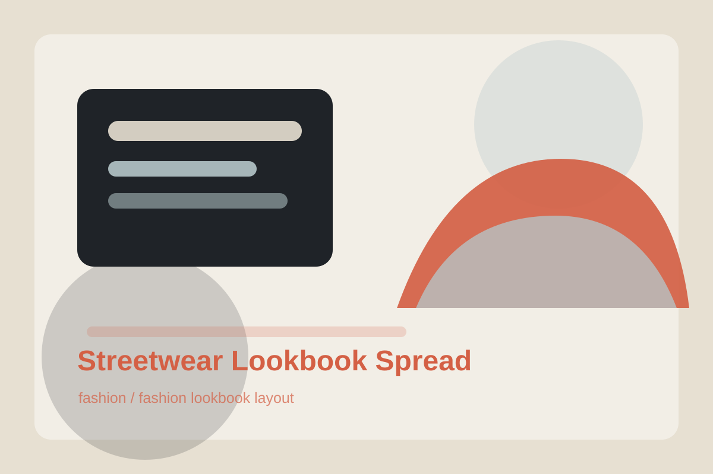

# Streetwear Lookbook Spread

## Use Case

适合 `fashion` 场景，可作为可复用的 GPT Image 2 提示词模板。

## Preview



## Prompt

```text
Create a two-page fashion lookbook spread for an original streetwear capsule collection. Show three models in layered neutral outfits with oversized jackets, cropped utility vests, wide trousers, and textured sneakers. Use an urban concrete courtyard, overcast daylight, editorial poses, and a layout with one large hero photo, two smaller detail crops, fabric swatches, and minimal caption blocks. The design should feel contemporary, grounded, and ready for a brand PDF lookbook.
```

## Negative Constraints

```text
Avoid real brand logos, celebrity likenesses, oversexualized styling, distorted hands, inconsistent outfits, illegible captions, and chaotic collage layout.
```

## Suggested Parameters

- Model: GPT Image 2
- Aspect ratio: 16:9
- Style: fashion lookbook layout
- Output: png or webp

## Why It Works

This prompt asks for a publication layout, not only a single fashion photo.
