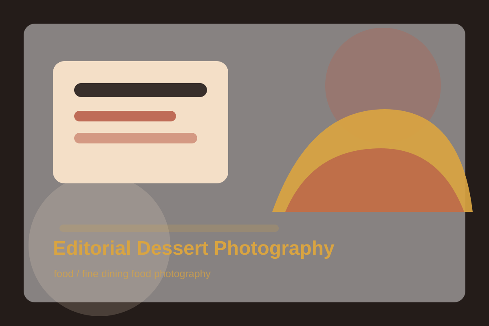

# Editorial Dessert Photography

## Use Case

适合 `food` 场景，可作为可复用的 GPT Image 2 提示词模板。

## Preview



## Prompt

```text
Create a fine-dining dessert photograph of a small plated citrus tart with torched meringue peaks, candied orange peel, a glossy sauce dot pattern, and a single edible flower. The plate is matte ivory ceramic on a dark walnut table. Use a low three-quarter camera angle, shallow depth of field, warm side light, realistic crumbs, and precise plating details. The image should feel intimate, refined, and suitable for a restaurant editorial feature.
```

## Negative Constraints

```text
Avoid oversized portions, messy sauce smears, plastic-looking food, fake flowers, harsh flash, warped plates, and visible brand marks.
```

## Suggested Parameters

- Model: GPT Image 2
- Aspect ratio: 4:5
- Style: fine dining food photography
- Output: png or webp

## Why It Works

The prompt controls plating, camera, lighting, and food texture, which are essential for believable food images.
