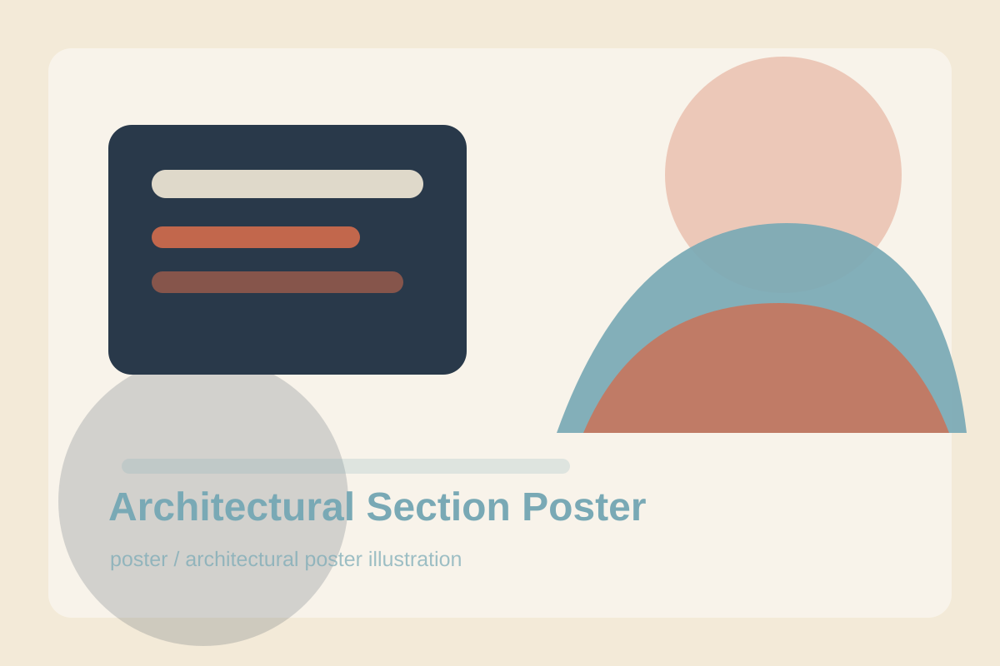

# Architectural Section Poster

## Use Case

适合 `poster` 场景，可作为可复用的 GPT Image 2 提示词模板。

## Preview



## Prompt

```text
Create a vertical architectural poster showing a cutaway section of a compact urban library. The building is sliced open like a precise editorial illustration, revealing reading rooms, staircases, book stacks, a rooftop garden, a cafe corner, and tiny visitors moving through the space. Use clean ink lines, soft watercolor fills, warm cream paper texture, and small numbered callouts with simple labels. Add a bold title area at the top reading 'Neighborhood Library'. The poster should feel educational, charming, and suitable for an architecture magazine.
```

## Negative Constraints

```text
Avoid impossible stair geometry, overcrowded rooms, misspelled title text, real institution logos, harsh neon colors, and messy perspective.
```

## Suggested Parameters

- Model: GPT Image 2
- Aspect ratio: 2:3
- Style: architectural poster illustration
- Output: png or webp

## Why It Works

Cutaway posters work well when the prompt separates structure, rooms, people, labels, and paper style.
