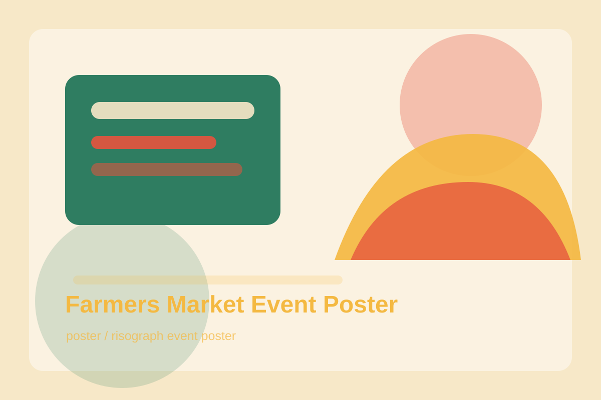

# Farmers Market Event Poster

## Use Case

适合 `poster` 场景，可作为可复用的 GPT Image 2 提示词模板。

## Preview



## Prompt

```text
Create a cheerful vertical risograph-style event poster for a fictional weekend farmers market. The central illustration shows a basket overflowing with tomatoes, peaches, leafy greens, flowers, and a small loaf of bread. Use bold flat shapes, slight print misregistration, grainy ink texture, and a palette of tomato red, leafy green, golden yellow, and cream. Leave clear typography zones for the title 'Saturday Market', date, location, and vendor list. The design should feel local, friendly, handmade, and print-ready.
```

## Negative Constraints

```text
Avoid real market names, illegible text blocks, too many tiny items, glossy 3D rendering, muddy colors, and cluttered background patterns.
```

## Suggested Parameters

- Model: GPT Image 2
- Aspect ratio: 2:3
- Style: risograph event poster
- Output: png or webp

## Why It Works

It asks for typography zones instead of relying on perfect generated event text.
