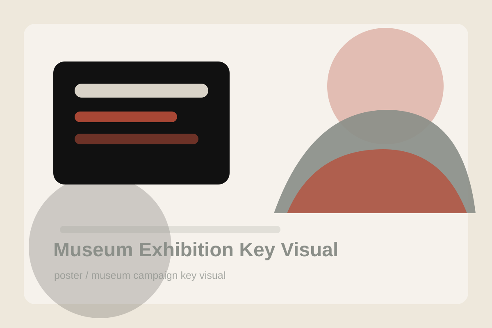

# Museum Exhibition Key Visual

## Use Case

适合 `poster` 场景，可作为可复用的 GPT Image 2 提示词模板。

## Preview



## Prompt

```text
Create a refined museum exhibition key visual for a fictional show titled 'Fragments of Tomorrow'. The image features a single abstract ceramic shard floating in the center, lit like a precious artifact, with subtle cracks, matte glaze, and a faint red reflection beneath it. Use a quiet stone-gray background, large negative space, elegant editorial composition, and restrained black and red typography areas. The mood should be intellectual, minimal, and suitable for a contemporary art museum campaign.
```

## Negative Constraints

```text
Avoid real museum logos, crowded artifacts, fantasy glow, messy typography, broken perspective, and cheap poster effects.
```

## Suggested Parameters

- Model: GPT Image 2
- Aspect ratio: 3:4
- Style: museum campaign key visual
- Output: png or webp

## Why It Works

It is a strong example of object-led branding with negative space and controlled mood.
