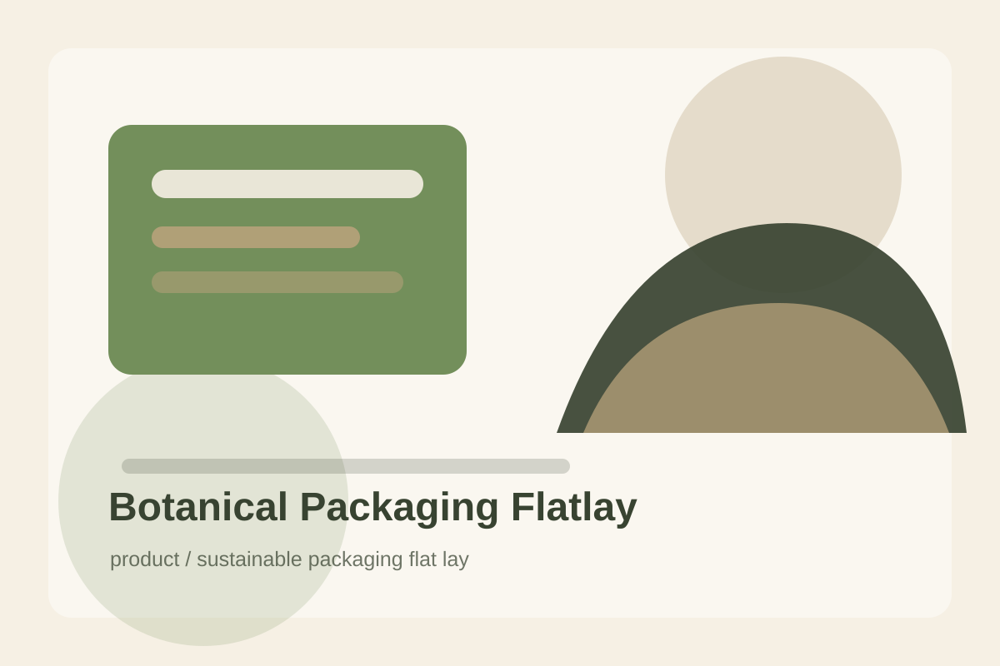

# Botanical Packaging Flatlay

## Use Case

适合 `product` 场景，可作为可复用的 GPT Image 2 提示词模板。

## Preview



## Prompt

```text
Create a clean flat-lay product photograph of sustainable botanical packaging for a fictional herbal soap brand. Arrange two kraft paper boxes, one unwrapped green soap bar, eucalyptus leaves, cotton string, recycled paper tags, and a small ceramic dish on a warm off-white surface. Use top-down composition, soft diffused daylight, natural shadows, and a restrained green, kraft, ivory palette. The design should look eco-conscious, premium, and easy to adapt for ecommerce thumbnails.
```

## Negative Constraints

```text
Avoid real logos, messy labels, excessive leaves, plastic wrap, warped boxes, illegible small text, and overly rustic dirt or stains.
```

## Suggested Parameters

- Model: GPT Image 2
- Aspect ratio: 3:2
- Style: sustainable packaging flat lay
- Output: png or webp

## Why It Works

Flat-lay constraints make the prompt reusable for many ecommerce packaging categories.
