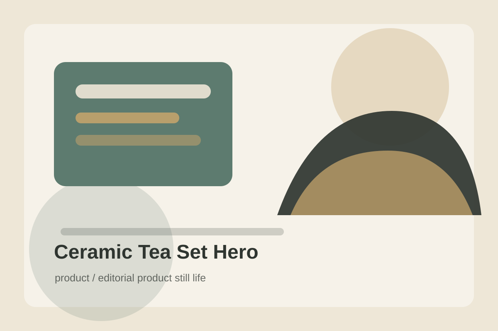

# Ceramic Tea Set Hero

## Use Case

适合 `product` 场景，可作为可复用的 GPT Image 2 提示词模板。

## Preview



## Prompt

```text
Create an editorial still-life photograph of a handmade ceramic tea set on a low stone table. Include a small teapot, two imperfect cups, loose tea leaves, a linen napkin, and a thin trail of steam. The ceramics have a speckled celadon glaze with tiny irregularities and hand-thrown edges. Use a muted beige background, soft side light, shallow depth of field, and quiet negative space. The image should feel artisanal, calm, tactile, and suitable for a boutique lifestyle catalog.
```

## Negative Constraints

```text
Avoid factory-perfect symmetry, glossy plastic texture, brand logos, excessive props, hard shadows, distorted cup rims, and over-saturated colors.
```

## Suggested Parameters

- Model: GPT Image 2
- Aspect ratio: 4:5
- Style: editorial product still life
- Output: png or webp

## Why It Works

It anchors the image in tactile craft details, which helps avoid generic lifestyle visuals.
