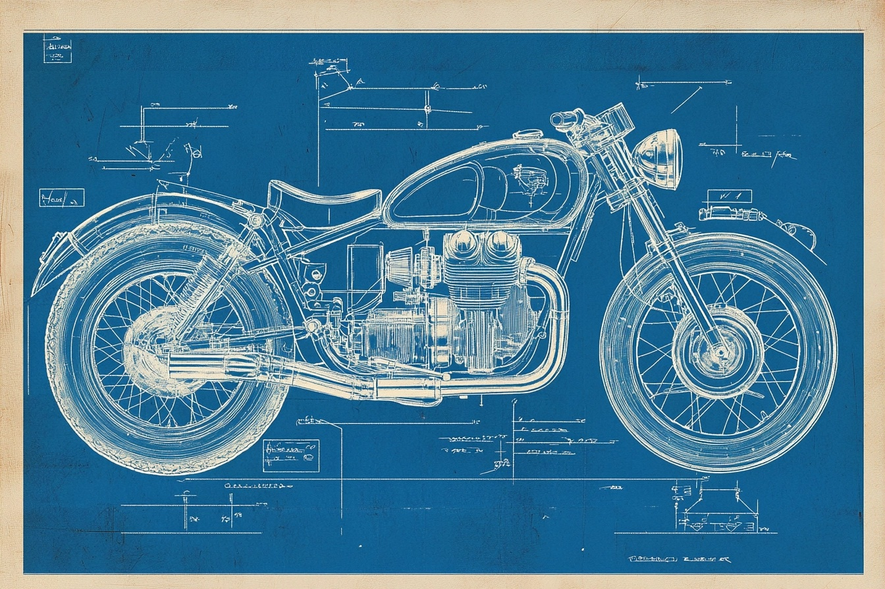

# Retro-Futuristic Blueprint Schematic

## Source

- Repository: [ImgEdify/Awesome-GPT4o-Image-Prompts](https://github.com/ImgEdify/Awesome-GPT4o-Image-Prompts)
- Author: Amira Zairi
- Original post: https://x.com/azed_ai/status/1914258586588639270
- License: MIT

## Image



## Prompt

```text
A blueprint schematic of a retro-futuristic motorcycle, drawn in the style of early 20th-century industrial patents. Rendered in crisp blue ink with white technical lines, featuring exploded views, angular labels, and stamped diagram codes.
```

## Why It Works

This case was selected because it is visually distinct, reusable as a prompt pattern, and has a clear source license in the upstream prompt collection.
