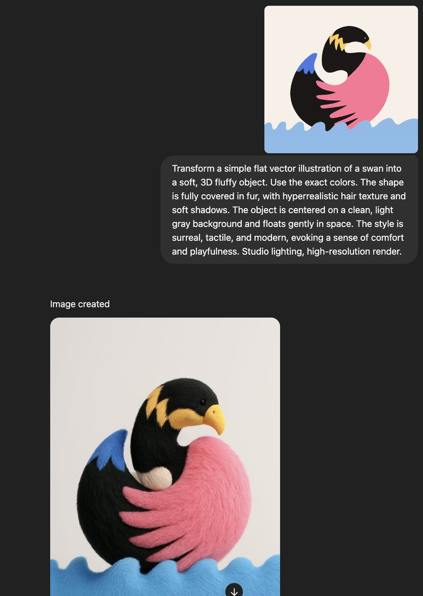

# Fluffy Swan Object

## Source

- Repository: [ImgEdify/Awesome-GPT4o-Image-Prompts](https://github.com/ImgEdify/Awesome-GPT4o-Image-Prompts)
- Author: Gizem Akdag
- Original post: https://x.com/gizakdag/status/1911781605569347976
- License: MIT

## Image



## Prompt

```text
Transform a simple flat vector illustration of a swan into a soft, 3D fluffy object. Use the exact colors. The shape is fully covered in fur, with hyperrealistic hair texture and soft shadows. The object is centered on a clean, light gray background and floats gently in space. The style is surreal, tactile, and modern, evoking a sense of comfort and playfulness. Studio lighting, high-resolution render.
```

## Why It Works

This case was selected because it is visually distinct, reusable as a prompt pattern, and has a clear source license in the upstream prompt collection.
