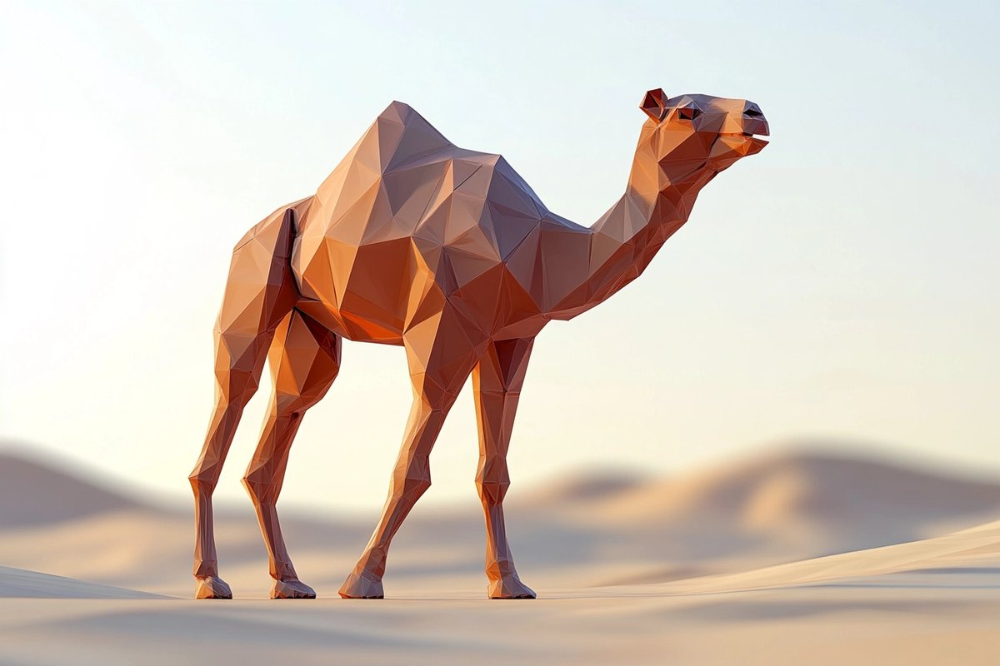

# Low Poly Desert Camel

## Source

- Repository: [ImgEdify/Awesome-GPT4o-Image-Prompts](https://github.com/ImgEdify/Awesome-GPT4o-Image-Prompts)
- Author: Amira Zairi
- Original post: https://x.com/azed_ai/status/1912084257918595342
- License: MIT

## Image



## Prompt

```text
A low-poly 3D render of a camel, built from clean triangular facets with flat sandy beige and burnt orange surfaces. The environment is a stylized digital desert with minimal geometry and ambient occlusion.
```

## Why It Works

This case was selected because it is visually distinct, reusable as a prompt pattern, and has a clear source license in the upstream prompt collection.
