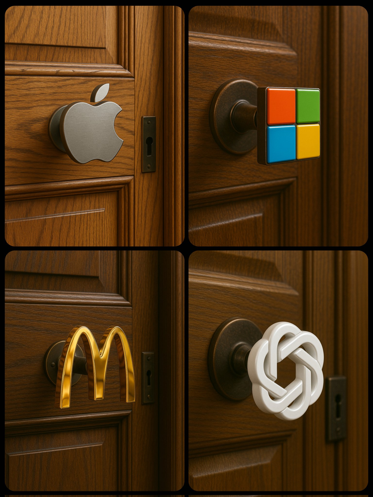

# Luxury Wooden Door Detail

## Source

- Repository: [ImgEdify/Awesome-GPT4o-Image-Prompts](https://github.com/ImgEdify/Awesome-GPT4o-Image-Prompts)
- Author: Umesh
- Original post: https://x.com/umesh_ai/status/1915243668870467950
- License: MIT

## Image



## Prompt

```text
A close-up photograph of a luxurious wooden door with detailed paneling and rich grain texture. The door features a custom-shaped doorknob in the form of the [LOGO_NAME] logo, made of polished material (metal, brass, ceramic, etc.) to look realistic and tangible. The handle is mounted on an antique bronze base, with soft, ambient lighting emphasizing the reflections, shadows, and depth of both the knob and door.
```

## Why It Works

This case was selected because it is visually distinct, reusable as a prompt pattern, and has a clear source license in the upstream prompt collection.
