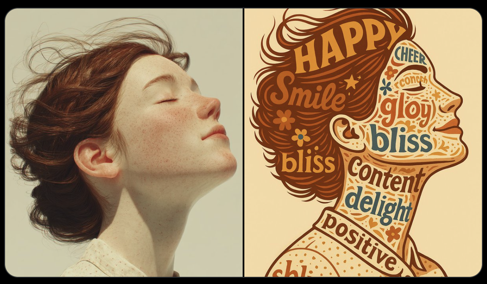

# Typographic Portrait

## Source

- Repository: [ImgEdify/Awesome-GPT4o-Image-Prompts](https://github.com/ImgEdify/Awesome-GPT4o-Image-Prompts)
- Author: firatbilal
- Original post: https://x.com/firatbilal/status/1911849629211050492
- License: MIT

## Image



## Prompt

```text
Recreate the attached image as Typography Portrait. Subject is happiness.
```

## Why It Works

This case was selected because it is visually distinct, reusable as a prompt pattern, and has a clear source license in the upstream prompt collection.
